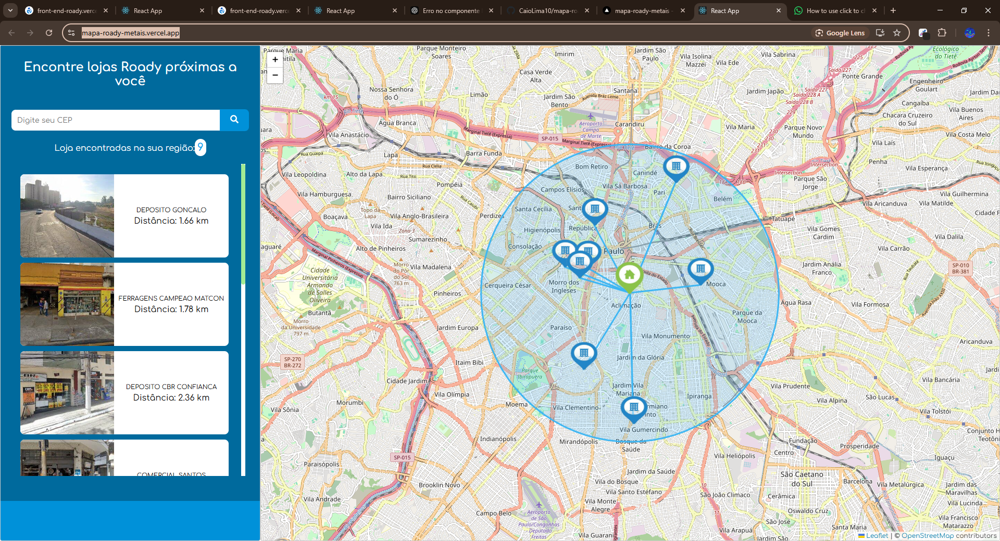

Projeto para empresa Roady Metais

---

1. Visualização do mapa com a biblioteca Leaflet.
2. Exibição dos clientes da empresa dentro de um raio de 5 km.
3. Pesquisa por CEP para encontrar lojas próximas.
4. Exibição da distância das lojas em relação ao cliente.
5. Modal para exibir informações dos clientes.
6. Design responsivo para computador, tablet e celular.
<br/>



---


Link do Deploy

```
https://mapa-roady-metais.vercel.app
```

Iniciar o Projeto

```
yarn start
```


